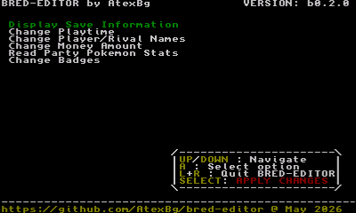
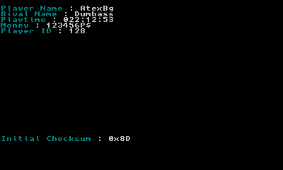
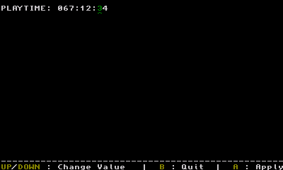

# BRED-EDITOR

## What is it?
The **bred-editor** (standing for *blue/red save editor*) is a very simple save editor for Pokémon Red/Blue on the 3DS, it's still W.I.P (work in progress) but many features are planned to be added later.

The current version is the `beta0.1.0`, having the following features :
    - Reading some informations about the save (including Player/Rival name, playtime, money, playerID and initial checksum)
    - Editing the Player/Rival names, the money amount and the playtime
    - Properly saving the file and fixing the checksum

I fixed many bugs and every feature should work, but it's not perfect and there is probably still bugs so please keep a backup of your savefile before using the tool. 
New features will be added in the future versions.

## Usage :
Put your savefile in `SD:/POKEMON.sav`

Install either the CIA of 3DSX executable and run it, then the menu is pretty user-friendly so you can just modify the data as you want. 
Then you can press SELECT on the main menu to **write all changes to the file**.

## Screenshots

---------------------------------

---------------------------------

## Future updates
I'm still working on the project and in the future i will add the following features :
- Editing data such as PlayerID, Badges, Bag Items, and various flags
- Editing the data of the Pokémons themselves (that will be funny mmhhhh)
- **Maybe** embed a little emulator inside the app (probably using a modified version of [my gb3ds emulator](https://github.com/AtexBg/gb3ds), which itself is a port of another open-source emulator)
- More features when i will have more ideas
--------------------------------------------
###### Fun fact: the program is called **bred-editor** because `bred` is a mix between blue and red, but i thought it sounded like "bread" so i decided to use bread for the icon/banner theme :3
--------------------------------------------
Thanks to [DevKitPro](https://devkitpro.org/wiki/Getting_Started) for the toolchain and some code, [this GBATemp thread](https://gbatemp.net/threads/cxitool-convert-3dsx-to-cia-directly.440385/) for the tools to make the CIA app, the [libctru examples](https://github.com/devkitPro/3ds-examples) for the uses of some functions, and [Bulbapedia](https://bulbapedia.bulbagarden.net/wiki/Save_data_structure_(Generation_I)) for the savedata structure.

License GPLv3. By [AtexBg](https://github.com/AtexBg). May 8 2026.
