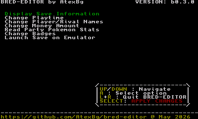
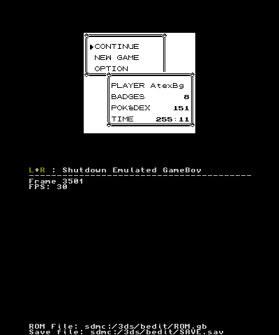
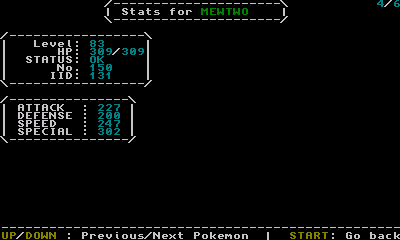
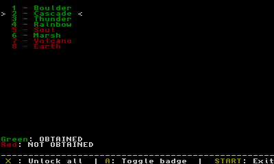
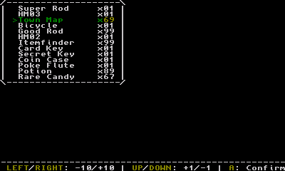

# BRED-EDITOR

## What is it?
### The **bred-editor** (standing for "*blue/red save editor*") is a simple save editor for Pokémon Red/Blue on the 3DS, it's still W.I.P but many features are planned to be added later.

The current version is the `beta0.4.0`, having the following features :

    - Reading information about the save (including Player/Rival name, playtime, money, playerID, checksum, badges, etc....)
    - Reading many stats about the Pokémons in the party
    - Editing the player Bag items
    - Editing information such as the Player/Rival names, the money amount, the playtime, etc...
    - Properly saving the file and fixing the checksum
    - Viewing Pokémon Team stats in detail
    - Changing obtained badges
    - A GameBoy emulator **embed into the app** to test changes
    - Automatic backup of the savefile

I fixed many bugs and every feature should work, but it's not perfect and there is probably still bugs so please keep a backup of your savefile before using the tool. 
New features will be added in the future versions.

## Usage :
Put your savefile in `SD:/3ds/bedit/SAVE.sav`

Install either the CIA of 3DSX executable and run it, then the menu is pretty user-friendly so you can just modify the data as you want. When the apps boots it automatically makes a backup of the savefile at `SD:/3ds/bedit/BACKUP.sav` and you can press **X**+**Y** on the main menu to restore it. 

You can also press SELECT on the main menu to **write all changes to the file**.

## About the emulator
This save editor have an embed emulator made from [deltabeard's gameboy-c](https://github.com/deltabeard/gameboy-c/) for quick testing, for obvious reasons the ROM file isn't included so you need to place a Pokémon Red/Blue ROM file at `SD:/3ds/bedit/ROM.gb` (versions of any language should work).

## /Screenshots (click the arrow to see)

   

  
  
    
  
    
  
    
  
    
  
    
  

## Yellow compatibility?
This save editor is made for the Red/Blue versions, but many offsets for data are the same on Yellow, so it may work too, i haven't tested but if you want to give it a try, go for it!

## Future updates
I'm still working on the project and in the future i will add the following features :

- Editing data such as PlayerID, and various flags
- Editing the data of the Pokémons themselves (that will be funny mmhhhh)
- Making a system to save/load multiple savefiles
- More features when i will have more ideas

## Added since last release:
- Custom color palettes in embed emulator depending on the version played
- Backup of the save file and ability to restore it
- New menu to read and edit items on the player's bag
- Fixed a few bugs with player/rival names
- More bugfixes...

## Issues:
- The embed emulator sometimes runs at 30FPS instead of 60 because of the VBlank intervals
- The color palette for Pokémon RED is too flashy and not 100% accurate
- A simple graphical renderer is already implemented but not used yet, such a waste!
- Pokémons can became corrupted when saving the file, that's why it's not enabled in this release
- Moves in the Pokémon viewing menu are still shown as internal IDs and not names

###### Fun fact: the program is called **bred-editor** because `bred` is a mix between blue and red, but i thought it sounded like "bread" so i decided to use bread for the icon/banner theme :3
--------------------------------------------
Thanks to [DevKitPro](https://devkitpro.org/wiki/Getting_Started) for the toolchain and some code, [this GBATemp thread](https://gbatemp.net/threads/cxitool-convert-3dsx-to-cia-directly.440385/) for the tools to make the CIA app, the [libctru examples](https://github.com/devkitPro/3ds-examples) for the uses of some functions, [gameboy-c](https://github.com/deltabeard/gameboy-c/) for the embed emulator code, and [Bulbapedia](https://bulbapedia.bulbagarden.net/wiki/Save_data_structure_(Generation_I)) for the savedata structure info.

License GPLv3. By @AtexBg. June 1 2026.
